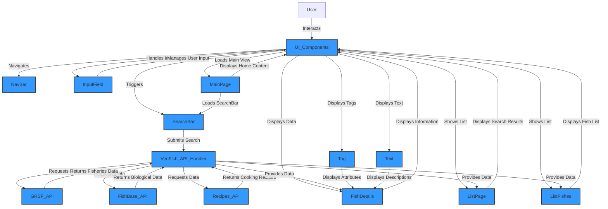

```mermaid
graph TD;
    User -->|Interacts| UI_Components;
    UI_Components -->|Triggers| SearchBar;
    UI_Components -->|Navigates| NavBar;
    UI_Components -->|Displays Data| FishDetails;
    UI_Components -->|Shows List| ListPage;
    UI_Components -->|Shows List| ListFishes;
    UI_Components -->|Handles Inputs| InputField;
    UI_Components -->|Displays Tags| Tag;
    UI_Components -->|Displays Text| Text;
    UI_Components -->|Loads Main View| MainPage;

    SearchBar -->|Submits Search| VeriFish_API_Handler;
    VeriFish_API_Handler -->|Requests Data| GRSF_API;
    VeriFish_API_Handler -->|Requests Data| FishBase_API;
    VeriFish_API_Handler -->|Requests Data| Recipes_API;
    
    GRSF_API -->|Returns Fisheries Data| VeriFish_API_Handler;
    FishBase_API -->|Returns Biological Data| VeriFish_API_Handler;
    Recipes_API -->|Returns Cooking Recipes| VeriFish_API_Handler;
    
    VeriFish_API_Handler -->|Provides Data| FishDetails;
    VeriFish_API_Handler -->|Provides Data| ListPage;
    VeriFish_API_Handler -->|Provides Data| ListFishes;
    
    FishDetails -->|Displays Information| UI_Components;
    ListPage -->|Displays Search Results| UI_Components;
    ListFishes -->|Displays Fish List| UI_Components;
    InputField -->|Manages User Input| UI_Components;
    Tag -->|Displays Attributes| FishDetails;
    Text -->|Displays Descriptions| FishDetails;
    MainPage -->|Loads SearchBar| SearchBar;
    MainPage -->|Displays Home Content| UI_Components;
    
    classDef component fill:#3399FF,stroke:#333,stroke-width:2px;
    classDef api fill:#3399FF,stroke:#333,stroke-width:2px;
    class UI_Components,SearchBar,NavBar,FishDetails,ListPage,ListFishes,InputField,Tag,Text,MainPage component;
    class VeriFish_API_Handler,GRSF_API,FishBase_API,Recipes_API api;
```

